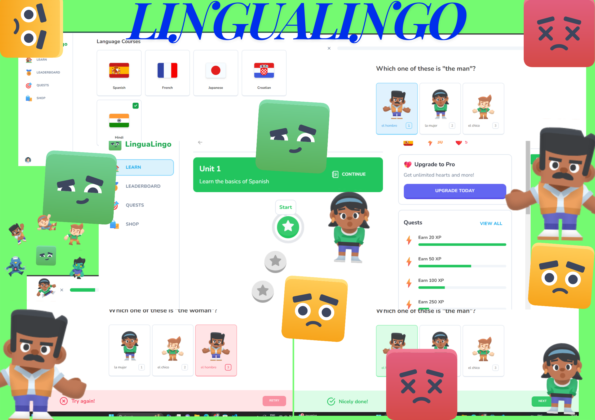

# LinguaLingo - Interactive platform for language learning.



## :bangbang: Folder Structure

Here is the folder structure of this app.

```bash
LinguaLingo/
|-lingo
  |- actions/
    |- challenge-progress.ts
    |- user-progress.ts
    |- user-subscription.ts
  |- app/
    |-- (main)/
        |--- courses/
        |--- leaderboard/
        |--- learn/
        |--- quests/
        |--- shop/
        |--- layout.tsx
    |-- (marketing)/
        |--- footer.tsx
        |--- header.tsx
        |--- layout.tsx
        |--- page.tsx
    |-- admin/
        |--- challenge/
        |--- challengeOption/
        |--- course/
        |--- lesson/
        |--- unit/
        |--- app.tsx
        |--- page.tsx
    |-- api/
        |--- challengeOptions/
        |--- challenges/
        |--- courses/
        |--- lessons/
        |--- units/
        |--- webhooks/stripe/
    |-- lesson/
        |--- [lessonId]/
        |--- card.tsx
        |--- challenge.tsx
        |--- footer.tsx
        |--- header.tsx
        |--- layout.tsx
        |--- page.tsx
        |--- question-bubble.tsx
        |--- quiz.tsx
        |--- result-card.tsx
    |-- favicon.ico
    |-- globals.css
    |-- layout.tsx
  |- components/
    |-- modals/
    |-- ui/
    |-- feed-wrapper.tsx
    |-- mobile-wrapper.tsx
    |-- mobile-sidebar.tsx
    |-- promo.tsx
    |-- quests.tsx
    |-- sidebar-item.tsx
    |-- sidebar.tsx
    |-- sticky-wrapper.tsx
    |-- user-progress.tsx
  |- config/
    |-- index.ts
  |- db/
    |-- drizzle.ts
    |-- queries.ts
    |-- schema.ts
  |- lib/
    |-- admin.ts
    |-- stripe.ts
    |-- utils.ts
  |- public/
  |- scripts/
    |-- prod.ts
    |-- reset.ts
    |-- seed.ts
  |- store/
    |-- use-exit-modal.ts
    |-- use-hearts-modal.ts
    |-- use-practice-modal.ts
  |- types/
    |-- canvas.ts
  |- .env
  |- .env.example
  |- .eslintrc.js
  |- .gitignore
  |- .prettierrc.json
  |- components.json
  |- constants.ts
  |- drizzle.config.ts
  |- environment.d.ts
  |- middleware.ts
  |- next.config.mjs
  |- package-lock.json
  |- package.json
  |- postcss.config.js
  |- tailwind.config.ts
  |- tsconfig.json
```
<br />

## :toolbox: Getting Started

1. Make sure **Git** and **NodeJS** is installed.
2. Clone this repository to your local computer.
3. Create `.env` file in **root** directory.
4. Contents of `.env`:

```env
# .env

# disabled next.js telemetry
NEXT_TELEMETRY_DISABLED=1

# clerk auth keys
NEXT_PUBLIC_CLERK_PUBLISHABLE_KEY=pk_test_XXXXXXXXXXXXXXXXXXXXXXXXXXXXXXXXXXXXXXXXXXXXXXXXXXXXXXXXX
CLERK_SECRET_KEY=sk_test_XXXXXXXXXXXXXXXXXXXXXXXXXXXXXXXXXXXXXXXXXXXXXXXX

# neon db uri
DATABASE_URL="postgresql://<user>:<password>@<host>:<post>/lingo?sslmode=require"

# stripe api key and webhook


# public app url
NEXT_PUBLIC_APP_URL=http://localhost:3000

# clerk admin user id(s) separated by comma and space (, )
CLERK_ADMIN_IDS="user_xxxxxxxxxxxxxxxxxxxxxxxxxxxxx, user_xxxxxxxxxxxxxxxxxxxxxx"

```

5. Obtain Clerk Authentication Keys

   1. **Source**: Clerk Dashboard or Settings Page
   2. **Procedure**:
      - Log in to your Clerk account.
      - Navigate to the dashboard or settings page.
      - Look for the section related to authentication keys.
      - Copy the `NEXT_PUBLIC_CLERK_PUBLISHABLE_KEY` and `CLERK_SECRET_KEY` provided in that section.

6. Retrieve Neon Database URI

   1. **Source**: Database Provider (e.g., Neon, PostgreSQL)
   2. **Procedure**:
      - Access your database provider's platform or configuration.
      - Locate the database connection details.
      - Replace `<user>`, `<password>`, `<host>`, and `<port>` placeholders in the URI with your actual database credentials.
      - Ensure to include `?sslmode=require` at the end of the URI for SSL mode requirement.

7. Fetch Stripe API Key and Webhook Secret

   1. **Source**: Stripe Dashboard
   2. **Procedure**:
      - Log in to your Stripe account.
      - Navigate to the dashboard or API settings.
      - Find the section related to API keys and webhook secrets.
      - Copy the `STRIPE_API_SECRET_KEY` and `STRIPE_WEBHOOK_SECRET`.

8. Specify Public App URL

   1. **Procedure**:
      - Replace `http://localhost:3000` with the URL of your deployed application.

9. Identify Clerk Admin User IDs

   1. **Source**: Clerk Dashboard or Settings Page
   2. **Procedure**:
      - Log in to your Clerk account.
      - Navigate to the dashboard or settings page.
      - Find the section related to admin user IDs.
      - Copy the user IDs provided, ensuring they are separated by commas and spaces.

10. Save and Secure:

    - Save the changes to the `.env` file.

11. Install Project Dependencies using `npm install --legacy-peer-deps` or `yarn install --legacy-peer-deps`.

12. Run the Seed Script:

In the same terminal, run the following command to execute the seed script:

```bash
npm run db:prod
```

This command uses `npm` to execute the Typescript file (`scripts/prod.ts`) and writes challenges data in database.

13. Verify Data in Database:

Once the script completes, check your database to ensure that the challenges data has been successfully seeded.

14. Now app is fully configured 👍 and you can start using this app using either one of `npm run dev` or `yarn dev`.

**NOTE:** Please make sure to keep your API keys and configuration values secure and do not expose them publicly.

## :camera: Screenshots


.png "Modern UI/UX")

.png "Quests")

.png "Shop")


.png "lesson")


## :gear: Tech Stack

[](https://react.dev/ "React JS") [](https://nextjs.org/ "Next JS") [](https://www.typescriptlang.org/ "Typescript") [](https://tailwindcss.com/ "Tailwind CSS") [](https://vercel.app/ "Vercel") [](https://www.postgresql.org/ "Postgresql")


## :gem: Acknowledgements

Useful resources and dependencies that are used in Lingo.

- Thanks to CodeWithAntonio: https://codewithantonio.com/
- Special Thanks to Kenney Assets: https://kenney.nl/
- Freesound: https://freesound.org/
- Elevenlabs AI: https://elevenlabs.io/
- Flagpack: https://flagpack.xyz/

## 🌐 Connect with me:
<p align="left">
<a href="mailto:preetiraj122000@gmail.com" style="text-decoration:none">
  
</a>
<a href="https://preetiraj3697.github.io/" target="_blank">
   
</a>
<a href="https://www.linkedin.com/in/preetiraj3697" style="text-decoration:none">
  
</a>
<a href="https://github.com/Preetiraj3697" style="text-decoration:none">
  
</a>
 <a href="https://medium.com/@preetiraj122000" style="text-decoration:none">
  
</a>
  <a href="https://www.youtube.com/channel/UCUm2fjgbYRGRfiSh4LqSPyA" style="text-decoration:none">
  
</a>
<br />


  

<br />
 

<p align="center"><code> © 2022 | Preeti Raj </code></p>
